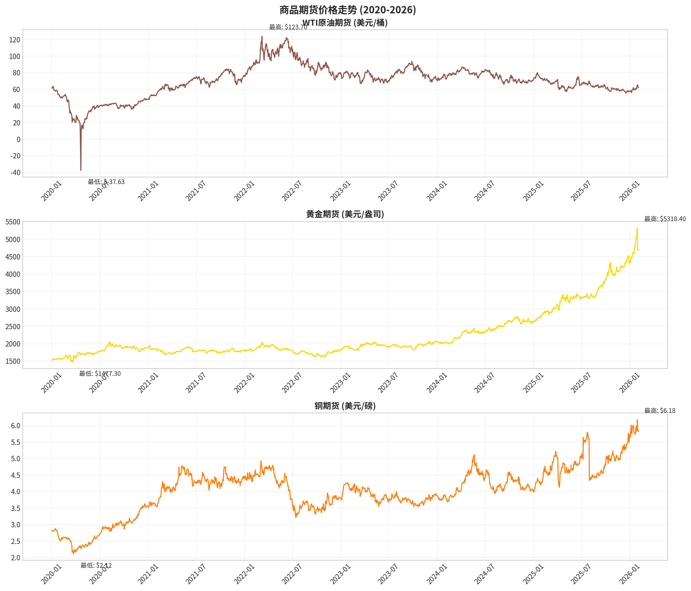
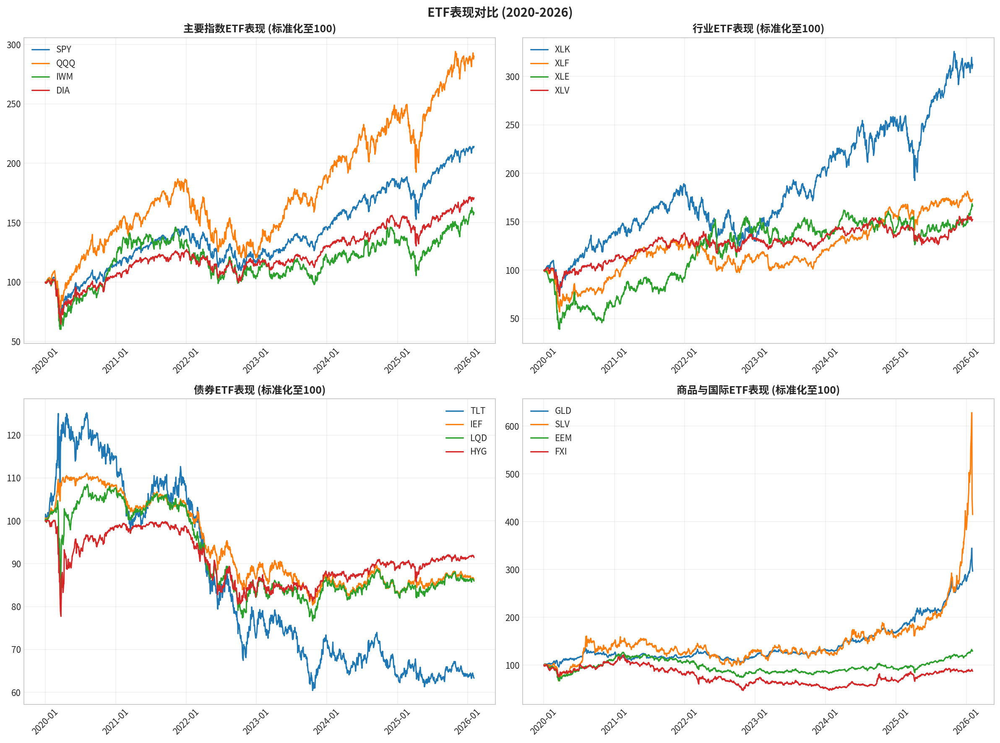
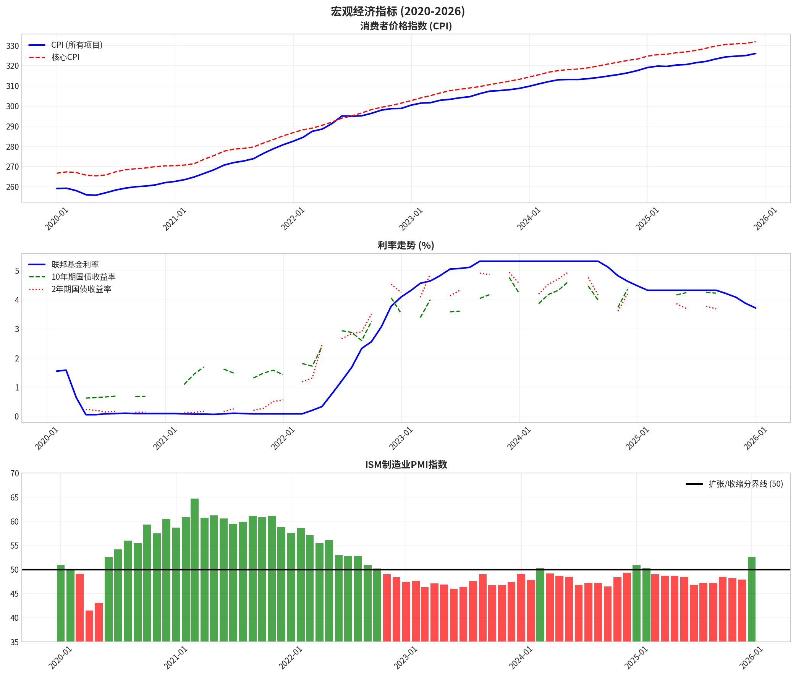
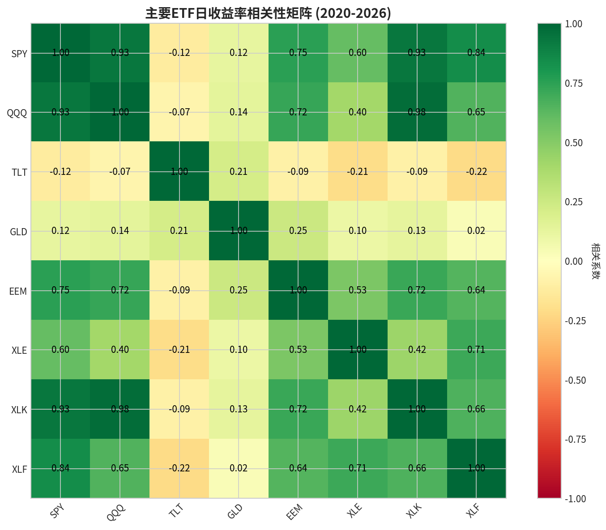
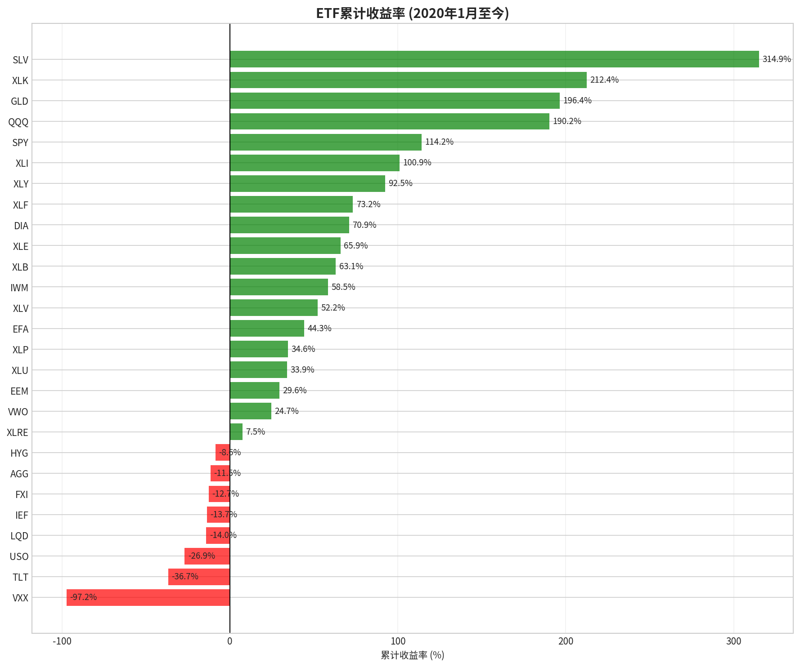

# 📊 Financial Data Hub

A comprehensive collection of financial market data including **ETF fund flows**, **commodity futures**, and **macroeconomic indicators** from 2020 to present.



## 📁 Repository Structure

```
financial-data-hub/
├── data/
│   ├── commodities/          # Commodity futures data
│   │   ├── commodity_futures_all.csv
│   │   ├── crude_oil_wti.csv
│   │   ├── gold.csv
│   │   └── copper.csv
│   ├── etf/                  # ETF price and volume data
│   │   ├── etf_data_all.csv
│   │   ├── etf_pivot_data.csv
│   │   └── etf_summary.csv
│   └── macro/                # Macroeconomic indicators
│       ├── macro_data_all.csv
│       ├── cpi_data.csv
│       ├── interest_rate_data.csv
│       └── ism_pmi_data.csv
├── charts/                   # Visualization charts
├── scripts/                  # Data collection scripts
└── docs/                     # Documentation and reports
```

## 📈 Data Coverage

### Commodity Futures (2020-2026)
| Commodity | Symbol | Data Points | Price Range |
|-----------|--------|-------------|-------------|
| WTI Crude Oil | CL=F | 1,534 | $-37.63 - $123.70 |
| Gold | GC=F | 1,534 | $1,477 - $5,318 |
| Copper | HG=F | 1,534 | $2.12 - $6.18 |

### ETF Data (2020-2026)
27 major ETFs covering:
- **Index ETFs**: SPY, QQQ, IWM, DIA
- **Sector ETFs**: XLK, XLF, XLE, XLV, XLI, XLU, XLP, XLY, XLB, XLRE
- **Bond ETFs**: TLT, IEF, LQD, HYG, AGG
- **Commodity ETFs**: GLD, SLV, USO
- **International ETFs**: EEM, EFA, VWO, FXI
- **Volatility ETN**: VXX

### Macroeconomic Indicators (2020-2026)
| Indicator | Series ID | Frequency | Source |
|-----------|-----------|-----------|--------|
| CPI (All Items) | CPIAUCSL | Monthly | BLS |
| Core CPI | CPILFESL | Monthly | BLS |
| Federal Funds Rate | FEDFUNDS | Monthly | Federal Reserve |
| 10-Year Treasury | DGS10 | Daily | Federal Reserve |
| 2-Year Treasury | DGS2 | Daily | Federal Reserve |
| 30-Year Treasury | DGS30 | Daily | Federal Reserve |
| ISM Manufacturing PMI | - | Monthly | ISM |
| Unemployment Rate | UNRATE | Monthly | BLS |

## 📊 Key Insights

### Top Performing ETFs (2020-2026)
| Rank | ETF | Name | Return |
|------|-----|------|--------|
| 1 | SLV | iShares Silver Trust | +314.9% |
| 2 | XLK | Technology Select Sector SPDR | +212.4% |
| 3 | GLD | SPDR Gold Shares | +196.4% |
| 4 | QQQ | Invesco QQQ Trust | +190.2% |
| 5 | SPY | SPDR S&P 500 ETF | +114.2% |

### Macroeconomic Highlights
- **CPI**: Increased from 259.13 to 326.03 (+25.8%)
- **Federal Funds Rate**: From 1.55% to 3.72% (peaked at 5.33%)
- **ISM PMI**: 35 expansion months vs 38 contraction months

## 📉 Visualizations

### ETF Performance Comparison


### Macroeconomic Indicators


### ETF Correlation Matrix


### ETF Total Returns


## 🔧 Data Sources

- **Yahoo Finance API**: Commodity futures and ETF data
- **FRED (Federal Reserve Economic Data)**: CPI, interest rates, unemployment
- **ISM (Institute for Supply Management)**: Manufacturing PMI

## 📝 Data Format

All CSV files follow a consistent format:
- **Date column**: YYYY-MM-DD format
- **Price columns**: Open, High, Low, Close
- **Volume column**: Daily trading volume
- **Additional columns**: Varies by dataset

## 🚀 Usage

### Python Example
```python
import pandas as pd

# Load commodity data
commodities = pd.read_csv('data/commodities/commodity_futures_all.csv')
commodities['Date'] = pd.to_datetime(commodities['Date'])

# Load ETF data
etf_data = pd.read_csv('data/etf/etf_data_all.csv')
etf_data['Date'] = pd.to_datetime(etf_data['Date'])

# Load macro data
macro_data = pd.read_csv('data/macro/macro_data_all.csv')
macro_data['Date'] = pd.to_datetime(macro_data['Date'])
```

## 📅 Update Schedule

Data is updated periodically. Last update: **February 2026**

## ⚠️ Disclaimer

This data is provided for educational and research purposes only. It should not be used as the sole basis for investment decisions. Always verify data accuracy and consult with financial professionals before making investment decisions.

## 📄 License

This project is licensed under the MIT License - see the [LICENSE](LICENSE) file for details.

## 🤝 Contributing

Contributions are welcome! Please feel free to submit a Pull Request.

---

**Created with ❤️ by Manus AI**
