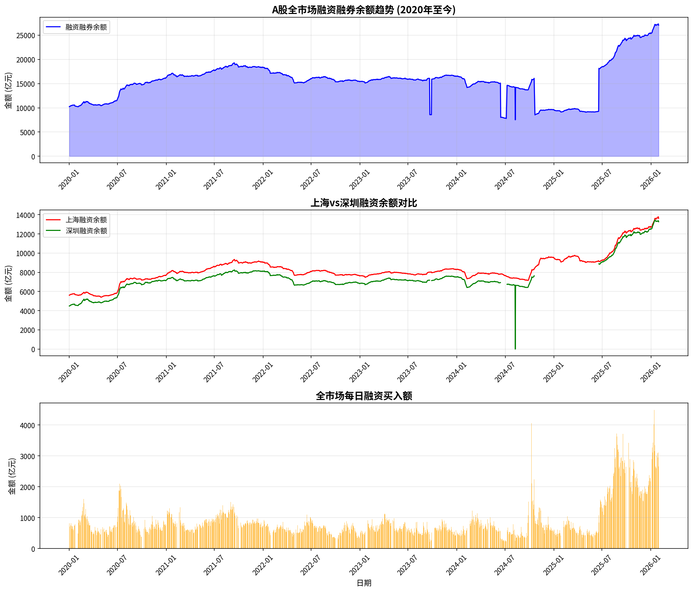
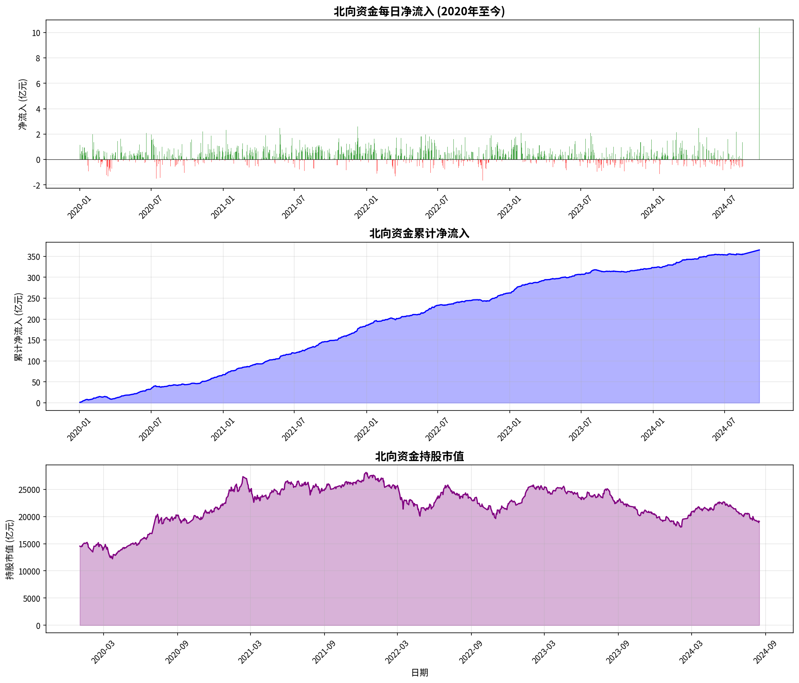
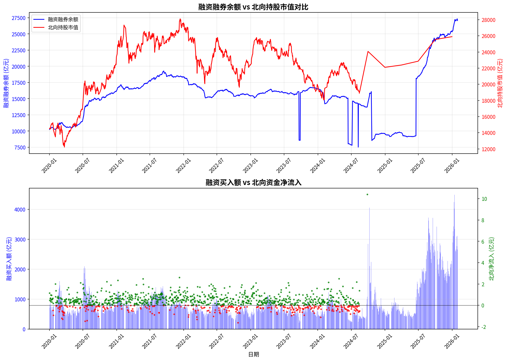

# 🇨🇳 A股市场数据 (China A-Share Market Data)

本目录包含A股市场两融数据（融资融券）和北向资金数据，时间范围为 **2020年至今**。

## 📁 目录结构

```
china-a-share/
├── margin/                   # 两融数据（融资融券）
│   ├── margin_summary_2020_to_now.csv    # 汇总数据（单位：亿元）
│   ├── margin_data_2020_to_now.csv       # 完整数据（原始单位）
│   ├── margin_sh_macro.csv               # 上海市场原始数据
│   └── margin_sz_macro.csv               # 深圳市场原始数据
└── northbound/               # 北向资金数据
    ├── northbound_summary_2020_to_now.csv # 汇总数据（单位：亿元）
    ├── northbound_full_raw.csv           # 北向资金原始数据
    ├── hgt_full_raw.csv                  # 沪股通原始数据
    └── sgt_full_raw.csv                  # 深股通原始数据
```

## 📊 数据概览

### 两融数据 (Margin Trading Data)

| 指标 | 数值 |
|-----|------|
| 时间范围 | 2020-01-02 至 2026-01-30 |
| 交易日数量 | 1,475 |
| 全市场融资融券余额（最新） | 27,064.74 亿元 |
| 全市场融资融券余额（最高） | 27,336.82 亿元 |
| 全市场融资买入额（平均） | 885.08 亿元 |

### 北向资金数据 (Northbound Capital Data)

| 指标 | 数值 |
|-----|------|
| 时间范围 | 2020-01-02 至 2026-02-02 |
| 有效数据交易日 | 1,074 |
| 累计净流入 | 365.28 亿元 |
| 北向持股市值（最新） | 25,897.54 亿元 |
| 净流入天数 | 784 天 |
| 净流出天数 | 290 天 |

## 📈 可视化图表

### 两融数据趋势


### 北向资金趋势


### 两融与北向资金对比


## 📝 字段说明

### 两融数据字段 (margin_summary_2020_to_now.csv)

| 字段名 | 说明 | 单位 |
|-------|-----|-----|
| 日期 | 交易日期 | - |
| 上海_融资余额(亿元) | 上海市场融资余额 | 亿元 |
| 上海_融资买入额(亿元) | 上海市场当日融资买入额 | 亿元 |
| 深圳_融资余额(亿元) | 深圳市场融资余额 | 亿元 |
| 深圳_融资买入额(亿元) | 深圳市场当日融资买入额 | 亿元 |
| 全市场_融资余额(亿元) | 沪深两市融资余额合计 | 亿元 |
| 全市场_融资买入额(亿元) | 沪深两市当日融资买入额合计 | 亿元 |
| 全市场_融券余额(亿元) | 沪深两市融券余额合计 | 亿元 |
| 全市场_融资融券余额(亿元) | 沪深两市融资融券余额合计 | 亿元 |

### 北向资金字段 (northbound_summary_2020_to_now.csv)

| 字段名 | 说明 | 单位 |
|-------|-----|-----|
| 日期 | 交易日期 | - |
| 北向_资金净流入(亿元) | 北向资金当日净流入 | 亿元 |
| 北向_成交净买额(亿元) | 北向资金当日成交净买额 | 亿元 |
| 北向_买入额(亿元) | 北向资金当日买入额 | 亿元 |
| 北向_卖出额(亿元) | 北向资金当日卖出额 | 亿元 |
| 北向_持股市值(亿元) | 北向资金持股市值 | 亿元 |
| 沪股通_* | 沪股通相关数据 | 亿元 |
| 深股通_* | 深股通相关数据 | 亿元 |

## 🔧 数据来源

- **两融数据**: 东方财富 / 上海证券交易所 / 深圳证券交易所
- **北向资金**: 东方财富数据中心

## 🚀 使用示例

```python
import pandas as pd

# 加载两融数据
margin_df = pd.read_csv('margin/margin_summary_2020_to_now.csv')
margin_df['日期'] = pd.to_datetime(margin_df['日期'])

# 加载北向资金数据
north_df = pd.read_csv('northbound/northbound_summary_2020_to_now.csv')
north_df['日期'] = pd.to_datetime(north_df['日期'])

# 查看最新数据
print(margin_df.tail())
print(north_df.tail())
```

## ⚠️ 注意事项

1. 北向资金数据在2024年8月后部分字段存在缺失
2. 所有金额数据已统一转换为亿元单位
3. 数据仅供参考，不构成投资建议

## 📅 更新时间

最后更新: **2026年2月**

---

*数据由 Manus AI 自动采集整理*
